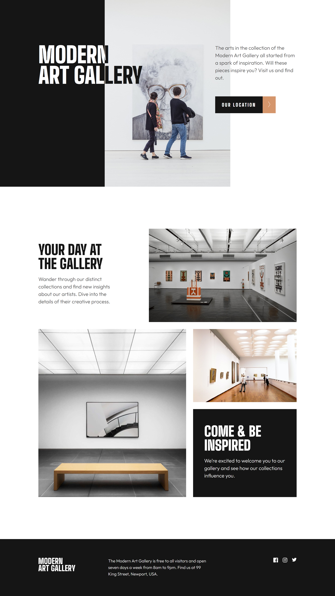

# Frontend Mentor - Art gallery website solution

This is a solution to the [Art gallery website challenge on Frontend Mentor](https://www.frontendmentor.io/challenges/art-gallery-website-yVdrZlxyA). Frontend Mentor challenges help you improve your coding skills by building realistic projects.

## Table of contents

- [Overview](#overview)
  - [The challenge](#the-challenge)
  - [Screenshot](#screenshot)
  - [Links](#links)
- [My process](#my-process)
  - [Built with](#built-with)
  - [What I learned](#what-i-learned)
  - [Continued development](#continued-development)
  - [Useful resources](#useful-resources)
- [Author](#author)
- [Acknowledgments](#acknowledgments)

## Overview

### The challenge

Users should be able to:

- View the optimal layout for each page depending on their device's screen size
- See hover states for all interactive elements throughout the site
- **Bonus**: Use [Leaflet JS](https://leafletjs.com/) to create an interactive location map with custom location pin

### Screenshot



### Links

- Solution: [URL](https://www.frontendmentor.io/solutions/art-gallery-website-using-sass-flexbox-and-grid-kDDdESRTIL)
- Live Site: [URL](https://miguelzaga.github.io/art-gallery-website/)

## My process

### Built with

- Sass
- Flexbox
- CSS Grid
- [Leaflet](https://leafletjs.com/) - JS library

### What I learned

#### Pseudoelements

I liked styling the buttons. I have seen how people use the ::before and ::after pseudoelements and I wanted to try it. I think I arrived to a cool solution.

```css
.btn-1 {
  @include btn();
  margin-right: 56px;
  &::after {
    @include btn-after();
    right: -56px;
    content: url("data:image/svg+xml,%3Csvg width='10' height='24' xmlns='http://www.w3.org/2000/svg'%3E%3Cpath stroke='%23FFF' fill='none' d='m1 0 8 12-8 12'/%3E%3C/svg%3E");
  }
  &:hover {
    @include btn-hover();
    &::after {
      @include btn-hover-after();
    }
  }
}
```

#### Leaflet

I learned about the Leaflet library and OpenStreet Map. Very useful and I loved the way it looks. I had to spend some time reading the documentation but it was worth it.

```js
function initializeMap() {
  var map = L.map("map", {
    center: [41.48, -71.3095],
    zoom: 15,
    zoomControl: false,
    scrollWheelZoom: false,
  });

  var myIcon = L.icon({
    iconUrl: "./app/assets/icon-location.svg",
  });

  L.tileLayer("https://{s}.tile.openstreetmap.org/{z}/{x}/{y}.png", {
    maxZoom: 19,
    attribution: "© OpenStreetMap",
  }).addTo(map);

  L.marker([41.481322, -71.31036], { icon: myIcon }).addTo(map);
}
```

### Continued development

These are some of the things that I want to improve on:
- The structure of Sass and JS files. 
- The way that I include svgs.
- Know more libraries
- Read faster documentation

### Useful resources

- [URL-encoder for SVG](https://yoksel.github.io/url-encoder/) - This helped me add the svg code of the arrows to the buttons in CSS.

## Author

- Website - [Miguel Zapata](https://www.miguezaga.online)
- Frontend Mentor - [@miguelzaga](https://www.frontendmentor.io/profile/miguelzaga)


